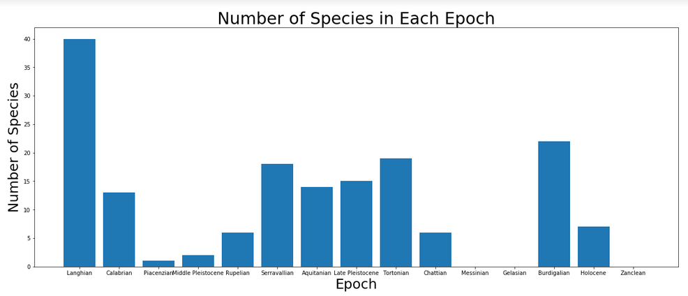
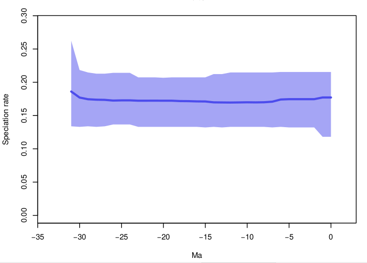
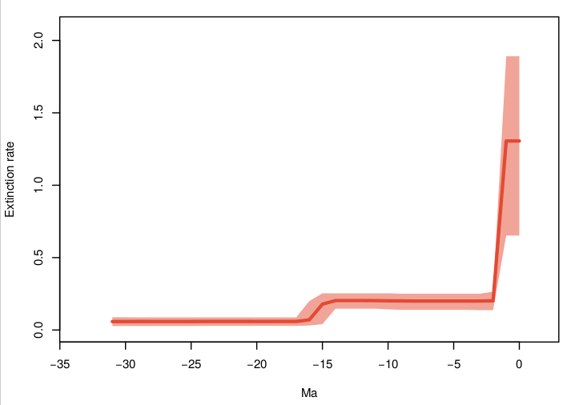
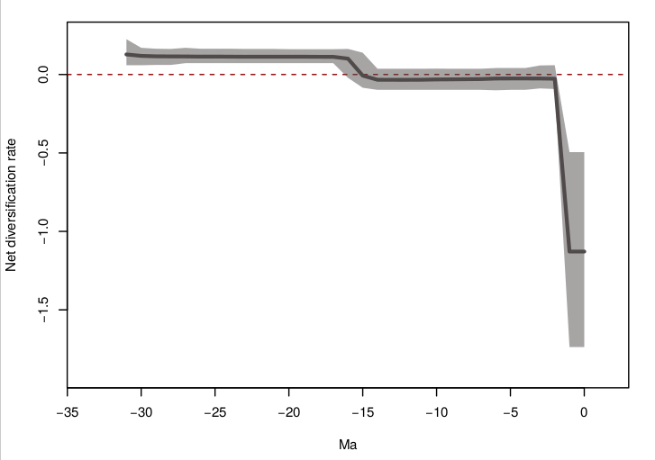

## Abstract

  The order Rodentia is classified as the largest order of mammals in terms of both number of families and indvidual species. The family Heteromyidae, within the Rodentia order, consists of smaller rodents, such as pocket mice. However, despite the abundance of species seen within the order as a whole, studies have shown that Heteromyidae is experiencing a decline in its species diversity. Thus, the goal of this paper is to determine the speciation, extinction and diversification rates of this family to track the species' progression through the fossil record and to determine whether or not extinction of this family is a possibility. In order to pursue this, I will use python to determine the duration of each species in the fossil record and RStudio to create a visual representation of that data. I will then use PyRate to calculate the speciation, extinction and diversification rates. Overall, it was found that the extinction rates have sharply increased recently in the geological timescale, and diversification rates have plummeted, suggesting that extinction is a viable possibility. 

## Introduction

  The family Heteromyidae, situated in the order Rodentia, is comprised of smaller rodents, such as kangaroo rats and pocket mice. They are located mainly in North America, with some species reaching down into South America. These rodents prefer deciduous and arid environments; however, some have adapted to live in othe places, such as rainforests and tropical cloud forests [@Alexander_2005]. The rodents in this family are typically characterized by light body builds, pouches for seed transport and longer leg limbs suited for jumping [@Fern_ndez_2014]. This family has had a substantial evolutionary history, dating back to the beginning of the Oligocene epoch [@Alexander_2005]. Based on geographical studies, Martin provides evidence that suggests that smaller mammals, such as those within the Heteromyidae family, have experienced higher rates of speciation. Current data suggests that this is still the case in terms of diversification [@Martin_2016]. Despite their susceptibility to higher speciation rates, the family Heteromyidae is exceptionally vulnerable to habitat loss, which could ultimately lead to an extinction of several of the species within the family [@PRICE_1989].

  Thus, when it comes to conservation efforts, this family is often overlooked. These animals mostly suffer from a change in the land use brought about by humans, habitat loss due to natural disaster, as mentioned above, and the fact that many people are unaware of their spatial distribution [@Fern_ndez_2014]. Rodents serve as a very important part of the ecosystem in terms of prey for carnivores. Many of their habitats have been separated due to human intervention, causing isolated groups to form in various locations [@Fern_ndez_2014]. While their habitats are shrinking and the stigma created against rodents in general remains constant, it is difficult to gain public support for the conservation of Heteromyidae. 

## Materials and Methods
### Fetching and Cleaning Data

  In order to explore the various aspects of the extinction and diversification rates, data from the species level was downloaded directly from the Paleobiolgy Database. The downloaded csv file was then checked and cleaned in the shell to ensure that the file was easy to work with. The shell commands used for this process are shown below. 

```{bash, eval = FALSE}
cp ~/Downloads/pbdb_data\(38\).csv ~/Desktop/eeb-177/eeb-177-final-project #moves the file into the correct working directory
mv pbdb_data\(38\).csv rat_data.csv # renames the file
tail -n +19 rat_data.csv | cut -d "," -f 6 | sort |uniq | wc -l # checking for the appropriate number of species
tail -n +18 rat_data.csv > cleaned-rat.csv # removes the header in the file
```

As commented within the code block above, the shell code moved and renamed the downloaded file into the correct working directory. Then, the code checked that the family had an adequate number of species to work with before removing the header. This code was used for both files downloaded from the Paleobiology Database, namely for the diversity data and for the fossil occurrence data.

### Diversity 

  Diversity data for the Heteromyidae family was analyzed in order to gain a better sense of the approximate number of species that were accounted for in each time epoch. After the data was gathered from the Paleobiology Database and cleaned as described in the code above, a function was created in a Python notebook that would help extract the needed data and organize it efficiently. To do this, the function created a dictionary, using a for loop, that would extract the time epoch from the appropriate column and insert each as a key within the dictionary. Then, the function would run through the data file, and, for every time epoch, the function would append the number of species found, from a different column, as a value to its associtated key. Finally, the function would return the completed dictionary. This Python code can be seen below.
  
```{python, eval = F}
#creating a dictionary for diversity of species in each time period
def DiversityDictionary(filename):
    diversity_dict = {} #creating an empty dictionary for the it
    diversity_data = open(filename, "r", encoding = "ISO-8859-15") 
    diversity_records = diversity_data.readlines()[21:]
    for line in diversity_records:
        line = line.replace('\"', '') 
        diversity_elements = line.split(",")
        epoch = diversity_elements[1] #setting the different epochs as the strings in column 2
        no_occurances = int(diversity_elements[8]) #setting the number of species in each epoch to the integers in column 9
        diversity_dict[epoch] = no_occurances #populating dictionary with epochs as keys and number of species as values
    return diversity_dict
```

  After the function was made, it was set equal to div_dict so that calling the function would be simpler and more informative. The data held within the div_dict dictionary was plotted using matplotlib, code shown below, which will be discussed in the results section below.
  
```{python, eval = F}  
div_dict = DiversityDictionary("rat_diversity.csv")
div_dict
```

```{python, eval = F}
# making the graph for the diversity data
import matplotlib.pyplot as plt
plt.figure(figsize=(21,8))
plt.bar(range(len(div_dict)), div_dict.values(), align='center') # bar height based on the dictionary values
plt.xticks(range(len(div_dict)), list(div_dict.keys())) # labelling the tick marks on the x axis as the various div_dict keys
plt.title('Number of Species in Each Epoch', fontsize = 30)
plt.xlabel('Epoch', fontsize = 25)
plt.ylabel('Number of Species', fontsize = 25)

plt.show()
```

### Fossil Occurrences Within the Family 

  The analysis and data manipulation for the fossil occurrences throughout the fossil record was slightly more involved, as there were several factors to look at. The first step was calculating the duration of each species in the fossil record, based on first and last occurrences, which were provided in terms of "million years ago". In order to do so, another function was created to perform this calculation. Much like the first function described, a for loop is used to run through the data file that contained the list of fossil occurrences. For each fossil occurrence, the minimum age was subtracted from the maximum age, and each value was appended to an empty list, as seen below. 

```{python, eval = F}
# if i wanted to calculate duration:
def calc_duration(filename):
    rat_age = [] #creates an empty dictionary where the keys and values will go into
    species = open(filename, "r", encoding = "ISO-8859-15") #will open the file with our data
    records = species.readlines()[19:] 
    for line in records:
        line = line.replace('\"', '') #removes the extra quotes
        record_elements = line.split(",") #denotes that each record element is separated by a file
        max_age = record_elements[14] #assigning max age to column 15
        min_age = record_elements[15] #assigning min age to column 16
        age = float(max_age) - float(min_age)
        rat_age.append(age)
    return rat_age

calc_duration("rat_data.csv") # calling on the function   
```

Since each of the values appended to the list were for each individual record in the data, the next step was to create a dictionary that would assign each of the duration values to the associated species. This function was created in the same way that the diversity dictionary was created. The main difference seen in the duration dictionary is that a calculation is being performed between to given columns to generate the values in the dictionary. This function was set equal to mydict for the aforementioned reasons.

```{python, eval = F}
#making a dictionary for species and ages, meaning duration of their existence
def GetDuration(filename):
    rat_dict = {} #creates an empty dictionary where the keys and values will go into
    rspecies = open(filename, "r", encoding = "ISO-8859-15") #will open the file with our data
    rat_records = rspecies.readlines()[19:] #this will read the file after line 19 which cuts out the heading
    for line in rat_records:
        line = line.replace('\"', '') #removes the extra quotes
        record_elements = line.split(",") #denotes that each record element is separated by a file
        species = record_elements[5] #making species be the keys and taking the names from column 6
        max_age = record_elements[14] #assigning max age to column 15
        min_age = record_elements[15] #assigning min age to column 16
        age = float(max_age) - float(min_age) #calculating the age of the fossil
        rat_dict[species] = age #assigning the age as the values in the dictionary
    return rat_dict

mydict = GetDuration("rat_data.csv") #running the function on my specific data file
mydict    
```

  For the later purposes of visualizing this data graphically, lists containing the first and last occurrences for each species would be useful. Thus, two more functions were created, one for each. Both of the functions, shown below, extract either the first occurrence data or the last occurrence data and append the value to the appropriate species in an empty dictionary.
  
```{python, eval = F}
#making a dictionary for the species and first occurance 
def FirstOccurance(filename):
    firstocc_dict = {} #creating an empty dictionary 
    species_data = open(filename, "r", encoding = "ISO-8859-15") #will open file
    firstocc_records = species_data.readlines()[19:] #reads the file
    for line in firstocc_records:
        line = line.replace('\"', '') 
        firstocc_elements = line.split(",")
        species = firstocc_elements[5] #populating the species with the data in column 6
        start_year = float(firstocc_elements[14]) #populating the start year with data from column 15 while also converting to float
        firstocc_dict[species] = start_year #assigning species as keys and start year as values
    return firstocc_dict

fo_dict = FirstOccurance("rat_data.csv") #performing the above function on my specific file
fo_dict    
```

```{python, eval = F}
#creating a dictionary of last occurances
def LastOccurance(filename):
    lastocc_dict = {} #creating an empty dictionary 
    rspecies_data = open(filename, "r", encoding = "ISO-8859-15") #will open file
    lastocc_records = rspecies_data.readlines()[19:] #reads the file
    for line in lastocc_records:
        line = line.replace('\"', '') 
        lastocc_elements = line.split(",")
        species = lastocc_elements[5] #populating the species with the data in column 6
        end_year = float(lastocc_elements[15]) #populating the end year with data from column 16 while also converting to float
        lastocc_dict[species] = end_year #assigning species as keys and end year as values
    return lastocc_dict

lo_dict = LastOccurance("rat_data.csv")
lo_dict    
```

  With multiple dictionaries, it would be effective to condense the information into one master dictionary. To do this, a collection from Python known as defaultdict was used. This collection takes the values from both the first occurrence and the last occurrence dictionaries and appends both to the species they belong to. This created a combined dictionary that houses all of the data in within one dictionary. Having a dictionary, such as this one, helps to familarize one with the data so that the data manipulation is more easily understood. 
  
```{python, eval = F}  
#creating a combined dictionary in which each key (species) has both first and last occurances as values

from collections import defaultdict

combined_dict = defaultdict(list) #creating lists for values within dictionary

for d in (fo_dict, lo_dict):
    for key, value in d.items():
        combined_dict[key].append(value) #append both values as a list for each key in a new combined dictionary
combined_dict
```

  The next step towards creating the graph for this data was to create a file containing only the data needed and to ouput that data to a csv file that could be used in RStudio. For this part of the process, the cleaned file, in which the header was removed in the shell, is used. The defaultdict collection is used once more along with a for loop to calculate the mean age of each fossil and append it to each species in the default dictionary being created. Once that is made, an output csv file is initialized. Using one last for loop, the genus, species, minimum age and maximum age are gathered and written to the new csv file that was initialized prior. The series of codes needed to complete this task are shown below. 
  
```{python, eval = F}  
infile = "clean-rat.csv"
with open(infile, 'r') as ff:
    rat_recs = ff.readlines()[1:] #reads in the cleaned file made earlier
```

```{python, eval = F}
#use defaultdict
from collections import defaultdict

species_ranges = defaultdict(list)

# make a dictionary
for line in rat_recs:
    species = line.split(",")[5]
    minage = float(line.split('","')[14]) # uses the values from column 15 for min age
    maxage = float(line.split('","')[15]) # uses values from column 16 for max age
    meanage = (minage + maxage) / 2
    
    species_ranges[species].append(meanage) # adds in species as the keys and mean ages as values to a list
```

```{python, eval = F}
output = open("rat-ranges.csv", "w") # this creates the new csv file where the desired data will be collected

for key in species_ranges.keys():
    ages = species_ranges[key]
    minage = min(ages)
    maxage = max(ages)
    genus = key.split(" ")[0]
    species = key
    outline = "{},{},{},{}\n".format(genus, key, minage, maxage)
    # adds in the values in this specific order
    output.write(outline)
```

The output file that gets created now contains only the desired data so that it can be easily used in RStudio. Using the ggplot package, a graph of the fossil occurrences over time can be made quite easily. The first step was to open the file in RStudio and check to make sure the data was correct. To do this, the following code was used.

```{r, eval = F}
#this will get the data from the csv file we made from python
library(ggplot2)
setwd("/home/eeb177-student/Desktop/eeb-177/homework/canids")

rats <- read.csv("/home/eeb177-student/Desktop/eeb-177/homework/canids/rat-ranges.csv", header =F, as.is = T)

names(rats) <- c("genus", "species", "minage", "maxage")
head(rats)
```

To make the actual graaph, the x and y axes were set to "Ma ago" and "Species". The other commands are used to clean up the graph by removing legends and tick marks, resizing the graph scales, flipping coordinates and adding graph labels. The code used can be seen below.

```{r, eval = F}
rats_occ <- ggplot(rats, aes( species, ymin = maxage, ymax=minage, colour = genus))
rats_occ <- rats_occ + geom_linerange()
rats_occ <- rats_occ + theme(legend.position="none") # this will get rid of the legend on the graph
rats_occ <- rats_occ + coord_flip() # this will flip the axis to maket he graph go the other direction
rats_occ <- rats_occ +  theme(axis.text.y = element_text(size=3)) # makes the text a more readable size
rats_occ <- rats_occ + theme(axis.ticks.y=element_blank()) # removes the tick marks that are present on the y axis
rats_occ <- rats_occ + scale_y_continuous(limits=c(0, 35), expand = c(0, 0), breaks=c(0, 5, 10, 15, 20, 25, 30, 35, 40)) # makes the graph fit more by removing the excess white space
rats_occ <- rats_occ + labs(title = "Heteromyidae Fossil Occurrences", x = "Species", y = "Ma ago") + theme(plot.title = element_text(hjust = 0.5, size=22, face = "bold"), axis.title =element_text(size=20))  # adding in the title and axis labels to the graph
rats_occ
```

The graph, which is depicted in the results section, was saved as a pdf using this code.

```{r, eval = F}
ggsave(filename = "rat-occ.pdf", plot = rats_occ)
```

### Speciation, Extinction and Diversification Rates

  The ultimate goal of this study is to look at speciation, extinction and diversification rates over time. PyRate is a program that specifically looks at datasets to calculate and graph all of these rates. This program was used for this project and was run for a total of 250,000 times. PyRate is not compatible with Python 3.0, so the terminal had to switch to Python 2.7 for this exercise. The program downloaded the data from the Paleobiology Database website and saved it as a new csv file. 

```{bash, eval = FALSE}
wget -O rats_occ.csv "https://paleobiodb.org/data1.2/occs/list.csv?base_name=Heteromyidae&show=acconly" #gets the data directly from the website and saves it in a csv document
```
  
A new R script was then created to translate the data into a PyRate-friendly format. This script also takes into account the extant species within the family, which were manually inputted. This script can be seen below.

```{r, eval = F}
source("~/PyRate/pyrate_utilities.r")

# we need to give the utilities a list of extant species
extant_rats = c("Perognathus flavus","Dipodomys spectabilis","Dipodomys ordii","Dipodomys merriami","Chaetodipus intermedius","Chaetodipus hispidus")

# use the extract.ages.pbdb() function in pyrate_utilities to reformat our dataset...
extract.ages.pbdb(file= "rats_occ.csv",extant_species=extant_rats)

# you should see the following output:

# "This function is currently being tested - caution with the results!"
# replicate 1
# PyRate input file was saved in:  ./rats_occ_PyRate.py 
```

  Once this script was run, a new file with the PyRate-formatted data was created. At this point, PyRate was ready to be run. In order to do so, the following code was entered into the terminal.

```{bash, eval = FALSE}
python ~/PyRate/PyRate.py rats_occ_PyRate.py -n 250000 # telling PyRate to run the function on the Heteromyidae data the desired number of times
```

A new directory was created that contained the files needed to plot the data. After navigating into the new directory, the following commands were used to plot and view the speciation, extinction and diversification graphs, which are displayed in the results section.

```{bash, eval = FALSE}
cd pyrate_mcmc_logs/ # moves into the new direcotry
python ~/PyRate/PyRate.py -plot rats_occ_1_marginal_rates.log # plots the graphs
see rats_occ_1_marginal_rates_RTT.pdf # opens the pdf document for viewing.
```
  
## Results and Discussion 
### Diversity

  The histogram depicting the number of species per time epoch is shown below.



As seen in the graph, fluctuation occurred throughout the fossil record in terms of the amount of species present at a given time. The epochs that were the most species rich were the Langhian and the Burdigalian. On the other hand, the Messinian, Gelasian and the Zanclean reported no species during that time. These three time periods are all fairly close together on the geological time scale, suggesting that some major event may have occurred that affected the speciation of Heteromyidae. Those three epochs are also relatively close to the current time period, evolutionarily speaking, which could indicate a downward trend in the diversity of the Heteromyidae species. 

### Fossil Occurrences Within the Family

  The purpose of this section was to gain a better understanding of where each species fit into the fossil record and to see the general amount of species still living today. According to the graph below, the number of currently extant species is considerably smaller than the total amount of species accounted for. 
  
```{r, echo=  F}  
#this will get the data from the csv file we made from python
library(ggplot2)
setwd("/home/eeb177-student/Desktop/eeb-177/homework/canids")

rats <- read.csv("/home/eeb177-student/Desktop/eeb-177/homework/canids/rat-ranges.csv", header =F, as.is = T)

names(rats) <- c("genus", "species", "minage", "maxage")

rats_occ <- ggplot(rats, aes( species, ymin = maxage, ymax=minage, colour = genus))
rats_occ <- rats_occ + geom_linerange()
rats_occ <- rats_occ + theme(legend.position="none") # this will get rid of the legend on the graph
rats_occ <- rats_occ + coord_flip() # this will flip the axis to maket he graph go the other direction
rats_occ <- rats_occ +  theme(axis.text.y = element_text(size=3)) # makes the text a more readable size
rats_occ <- rats_occ + theme(axis.ticks.y=element_blank()) # removes the tick marks that are present on the y axis
rats_occ <- rats_occ + scale_y_continuous(limits=c(0, 35), expand = c(0, 0), breaks=c(0, 5, 10, 15, 20, 25, 30, 35, 40)) # makes the graph fit more by removing the excess white space
rats_occ <- rats_occ + labs(title = "Heteromyidae Fossil Occurrences", x = "Species", y = "Ma ago") + theme(plot.title = element_text(hjust = 0.5, size=22, face = "bold"), axis.title =element_text(size=20))  # adding in the title and axis labels to the graph
rats_occ
```

Based on the figure of fossil occurrences, it shows that there are only about six extant species of the Heteromyidae family. This is only a fraction of the total amount of Heteromyidae species. However, the graph also shows that there was a significantly greater amount of extant species around six to nine million years ago. Thus, it can be inferred that there may have been some time of geological event that affected the diversification of the Heteromyidae species. Up until ten million years ago, there appeared to be a fairly constant level of species diversity throughout the fossil record. Therefore, the drop in species diversity is a relatively recent phenomenon, in terms of the fossil record. 

### Speciation, Extinction and Diversification Rates

  The main focus of this paper was to look at the speciation, extinction and diversification rates of the Heteromyidae family throughout the fossil record. The PyRate program completed this task and produced the following graphs. 
  
  

As seen in the Speciation Rates graph, the overall speciation rates reamined about the same since their origination about 32 million years ago. This could potentially mean that external factors were the reason for the decline of species diversity in this family. 

  Looking at the extinction and diversification graphs, the trends are significantly more severe as compared to the speciation rate graph. The extinction rate had been fairly constant with only a slight increase in extinction rates seen around 15 million years ago. This persisted until about two million years ago, when the extinction rate sharply increased to a rate almost ten times that of the previous rate. 
  


This huge increase in extinction rates led to a very significant decrease in the net diversification rate around the same time. Both of these rates seems to have plateaued in recent years; however, the extinction rate is still exceptionally high and the net diversification rate is exceptionally low.



  
 
 
  Research has shown that climatic shifts in the environment within the last five million years has lead to changes in species richness and fragmentation of populations [@Badgley_2008]. All of these factors can lead to species extinction and reduced diversification. This means that it is possible that the habitats of the various Heteromyidae species were subject to such climatic shifts, which could account for the increase in extinction rates. These temperature and precipitation shifts greatly affected the food options available for animals such as rodents, which also could have influenced the extinction and diversification rates [@Badgley_2008]. Looking ahead at more recent influences, humans have also greatly contributed to the decrease in species diversity of the Heteromyidae family. These mammals are native to North America, which is a very heavily populated area in terms of humans. Thus, constant human intervention due to human land use disrupts and potentially fragments the rodent populations. This is augmented by the fact that many people are simply unaware of the spatial distribution of this species [@Fern_ndez_2014]. 

## Conclusion

  Based on the work completed in this paper, extinction seems to be a viable possibility for the Heteromyidae family. When looking at the diversity histogram, the time periods with the least species were closer to the current geological time period. This means that the decreased species diversity was a change that occurred relatively recently. The fossil occurrence graph also shows that, compared to about seven million years ago, there are currently considerably less extant species. This also shows that there was a turning point in the fossil record of this family, creating a shift towards extinction. Finally, based on the increased extinction rates and the decreased net diversification rates, the Heteromyidae family does seem to be headed towards extinction. Because of this data, it is apparent that a conservation effort needs to be made to protect this family from potential extinction. The human impact on their habitats have created a difficult living environment for these rodents. The social stigma against rodents also plays a role in conservation efforts. Since many people are not passionate about protecting rodent species, gathering public and monetary support for the Heteromyidae family has proven to be difficult. Clearly, stronger action needs to be taken to ensure that this endangered family has enough resources to help them grow and thrive. 

\clearpage

## References

